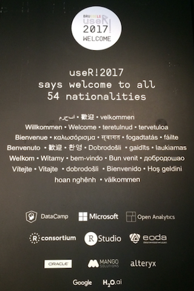
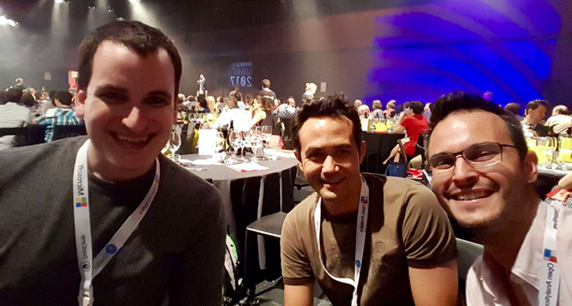
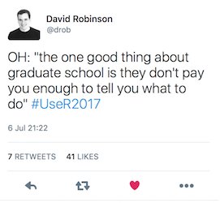
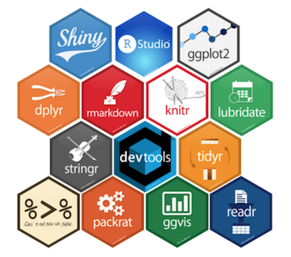

## What I learned from my first useR! conference

It has been exactly one week since the ending of the [useR!2017 conference](http://www.user2017.brussels) in Brussels, Belgium. I have to say that I am so happy that I decided to go to the conference. To put it succintly, it was the best conference I have ever attended.

At first, I was a bit hesitant to even register for the conference. I thought to myself, "Man, you haven't been using R for that long. You're going to stick out like a sore thumb. Everyone knows more than you!" This thought was quickly followed by several others all along the lines of convincing myself that I'm an [imposter](https://en.wikipedia.org/wiki/Impostor_syndrome). Thankfully, I got over these self-defeating sentiments and registered for the conference, paying out of my own pocket. This conference was too big of an opportunity to miss and boy am I glad I went.

Here are some of the key take-aways for me.

### R is much more than a programming language: it is also a community

Tucked away in my office at work or at home, I often feel isolated in my quest to become a data scientist. I haven't met personally with any local R users, not even at my own institute (though I hope to change this in the near future!). Typically my enthusiasm for R is celebrated in isolation, usually when learning something new through an online course, book or youtube video. So it was quite a shock to arrive at the conference venue and encounter roughly a thousand other R users!

Aside from the initial overwhelm of taking in the sheer number of attendees, was the very friendly and welcoming attitude that generally permeated the conference. People were genuinely happy to be there and happy to discuss all things R and not R. To me, it felt like the community was very inclusive and non-judgemental -- in general very respectful and welcoming of people from all walks of life and experience levels. 

### I got to meet cool people

One of the major highlights of my useR!2017 experience was getting to meet a lot of different people: statisticians, data scientists, economists, teachers and even an old colleague. An ad hoc `DrinkeR` whatsapp group was even formed so that good beer could be drunk in good company. 

useR!2017 granted me the opportunity to personally speak with "actual data scientists". Strangely enough, I had never met an industry data scientist prior to this conference, so I took every occasion to ask questions on what their path to data science looked like. I got some great encouragement and some information on what their interview processes were like. I have to admit, I was a little intimidated of some of things I read on the internet regarding the entire interview process of getting hired as a data scientist, but after talking with several people at the conference I realized that no one was perfectly ready, everyone was nervous and to just go for it.  

Another big highlight was getting to meet and chat with David Robinson, chief data scientist at Stack Overflow. Not only did he give a great presentation, he's extremely gregarious and super open to giving advice and tips. 

We had some nice conversations about life in academia, the usefulness of data science bootcamps, work life balance and how to best manage your time to get the most out of it. 

One of the reasons I was inspired to go to this conference was that I recently took the Duke University Coursera specialization, ["Statistics with R"](https://www.coursera.org/specializations/statistics) and was just so impressed by the material and had a great experience in the course. When I saw that one of the lead instructors for this course, Dr. Mine Çetinkaya-Rundel was going to be a keynote speaker, I knew I had to register just for the off chance that I could meet her in person and thank her for doing such a wonderful job at teaching. Incidentally, I think she gave one of the best talks of the entire conference, which you can [watch here](https://channel9.msdn.com/Events/useR-international-R-User-conferences/useR-International-R-User-2017-Conference/KEYNOTE-Teaching-data-science-to-new-useRs). Anyway, long story short - yes, I got to meet her and say thank you in person on the last day of the conference after the closing ceremony, which was super cool.

### I saw a lot of interesting talks

Aside from the social aspects that I've mentioned above, the breadth of topics covered at this conference was incredible. There were so many different threads and interests represented, all tied together through the common use of R. One of the drawbacks of having such a large conference is that almost all sessions ran in parallel, so you had to pick and choose what you wanted to see. Fortunately, all talks are now [available online](https://channel9.msdn.com/Events/useR-international-R-User-conferences/useR-International-R-User-2017-Conference?sort=rating&direction=asc) in HD video. 

Some of the talks I enjoyed are (not limited to) the following:

- [Teaching data science to new useRs - Mine Cetinkaya-Rundel (Duke University and RStudio, USA)](https://channel9.msdn.com/Events/useR-international-R-User-conferences/useR-International-R-User-2017-Conference/KEYNOTE-Teaching-data-science-to-new-useRs)

- [Text mining, the tidy way - Julia Silge (Data Scientist at Stack Overflow)](https://channel9.msdn.com/Events/useR-international-R-User-conferences/useR-International-R-User-2017-Conference/Text-mining-the-tidy-way)

- [Structural Equation Modeling: models, software and stories - Yves Rosseel (Gent University, Belgium)](https://channel9.msdn.com/Events/useR-international-R-User-conferences/useR-International-R-User-2017-Conference/KEYNOTE-Structural-Equation-Modeling-models-software-and-stories)

- [Scraping data with rvest and purrr - Max Humber](https://channel9.msdn.com/Events/useR-international-R-User-conferences/useR-International-R-User-2017-Conference/Scraping-data-with-rvest-and-purrr)

If you missed the conference, have a look at the [program](https://user2017.brussels/schedule) and then go find the video on [channel9](https://channel9.msdn.com/Events/useR-international-R-User-conferences/useR-International-R-User-2017-Conference/)!

### I discovered that useRs have a hex sticker obsession

I guess I was totally out of the loop, but prior to attending useR, I had no idea how obsessed people are with collecting hex stickers. Well, I have to say that I totally love it and jumped on the bandwagon. I plastered a few stickers on my machine in honor of the tidyverse and to show my support for online education platforms like [Datacamp](www.datacamp.com). 

### Final remarks

I thoroughly enjoyed my first useR event. What made the event so special for me was not just the quality of the content, but the quality of the community. There is a real sense of camaraderie shared amongst useRs. I look forward to the next event, [useR!2018 in Brisbane, Australia](/registration/). I am not sure if I will be able to attend, but I've always wanted to visit Australia and this might be the purrfect reason to go! 

If you find yourself reading this and are unsure if going to a conference like useR! is right for you, I highly recommend taking the plunge and just going for it! You'll meet wonderful people, learn tons of stuff and have a great time!

